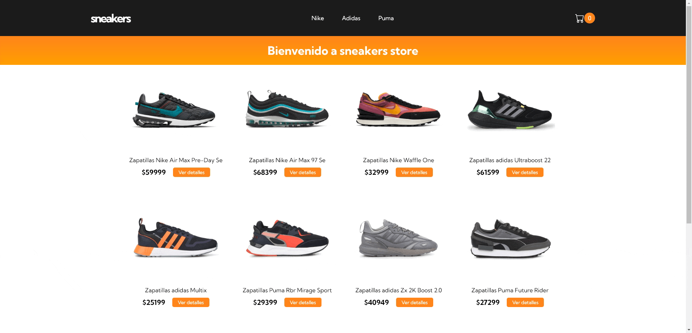

# Ecommerce sneakers.

Este es un proyecto basado en un Ecommerce de zapatillas para el curso de React JS de Coderhouse.

## Page navigability preview

# Tecnología

Es un proyecto realizado con create-react-app

# Dependencias extras

- Sass: utilizada para dar estilos a los componentes.
- Firebase: utilizado como Backend del proyecto.
- react-router-dom: utilizado para darle navegabilidad al proyecto.
- react-toastify y sweetalert2: se utilizan para mostrar notificaciones en pantalla y generar una mejor experiencia de usuario.

# Pasos para la instalación del proyecto

    1-Clonar el repositorio utilizando el comando: git clone https://github.com/hdalarcon/proyect-ecommerce.git

    2-Una vez dentro de la carpeta del proyecto instalar las dependencias utilizando el comando: npm install

    3-Se debe implementar la configuración e inicialización de firebase al proyecto.

    3-Se necesita crear una colección llamada "products" en firebase para poder traer los productos, dentro de esa colección cada documento será un producto y debe tener los siguientes datos:

        - id: generado automaticamente por firebase.
        - category (string): es la marca del producto.
        - price (number): precio del producto.
        - description (string): descripción del producto.
        - free_shipping (boolean): en "true" el envio del producto es gratis, en "false" no lo es.
        - img (string): debe tener la url de la imagen del producto.
        - stock(number): precio del producto.

    4-Levantar el servidor local para correr el proyecto con el comando: npm start
